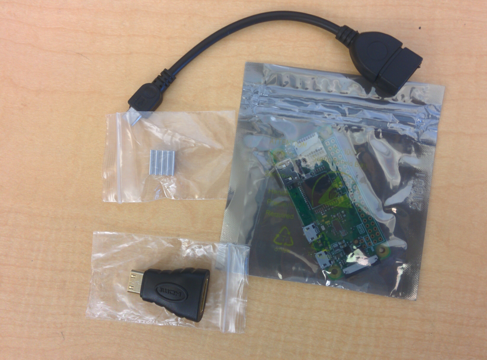

# ocmake
Ohlone College Maker Fair Repo

## Part 1: Setting Up Hardware 

### Step 1:


##### Make sure your station includes a kit with all these parts as well as a moniter and a keyboard


##### Make sure your bag of cases also includes a short ribbon connection and your yellow box has a power cable in it

##### In the other baggie, you will find heat sinks, a microusb to usb connector, and mini-hdmi to hdmi conertor

### Step 2:

##### Go ahead and connect your microusb to usb connector to your keyboard

### Step 3:

##### Make sure you have a microsd card along with a raspberry pi in your kit


##### Go ahead and place microsd card in the pi with the golden leads facing the board

### Step 4:


##### Locate your pi camera and take it out of its bag.

### Step 5:

##### Make note if its long white connector label


##### Very carefully, you must pull the black part of the ribbon cable connector to free the cable

### Step 6:


##### After removing the longer cable, replace it with your shorter cable from earlier. The wide end shoudl be attached to your camera.

### Step 7:


##### Very carefully attatch it to your pi


##### If all went well, your pi should look like above.


##### Selecting the red base, carefully snap the pi into place.


##### If done right, your pi should fit snuggly in as above.


##### Make sure to remove the tape off the camera.

### Step 8:


##### Of the white tops, select the one with the camera hole in the center


##### Try your best to align the camera hole with your camera and snap the top cover onto the base


##### If properly done, your pi should look like the picture above.

### Step 9:

##### Attach your mini hdmi to hdmi connector to your vga adapter 

### Step 10:

##### 1. Attach your mini hdmi to hdmi to vga adapter to the far left mini hdmi port
##### 2. Attach your keyboard cord to your middle microusb port.
##### 3. Attach your power microusb to the power micorusb port on the far right.


## Part 2: Setting Up Software
### Step 1:
To allow us to be able to access the camera, run
```
$ pip install picamera
```

### Step 2:
To install opencv run the following command
```
$ pip instal opencv-python
```
### Step 3:
Copy the project directory and then move into
```
$ git clone https://github.com/jaures/ocmake.git && cd ocmake
```

### Step 4:
We will switch to the branch with the raspberry pi version of the code
```
$ git checkout develop
```

### Step 5:
To run our program we type
```
python fsDetect.py
```
